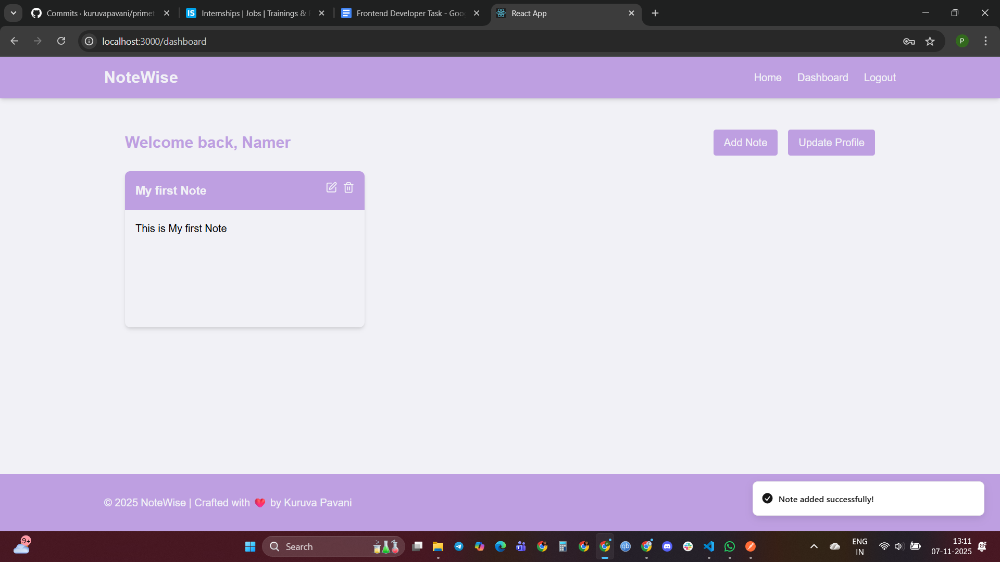
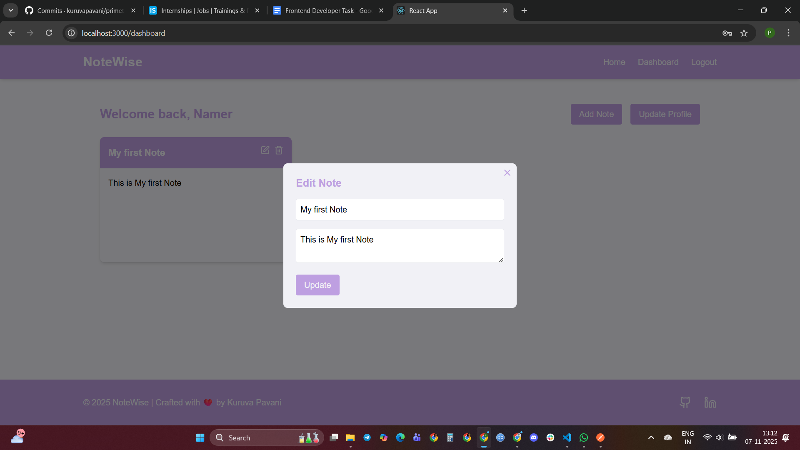
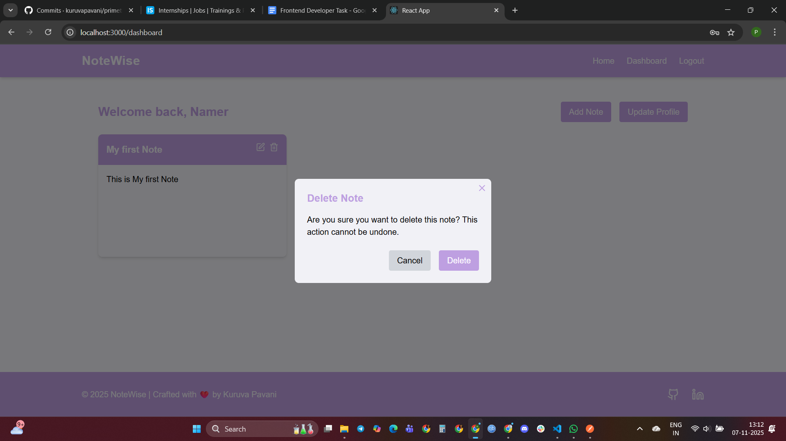
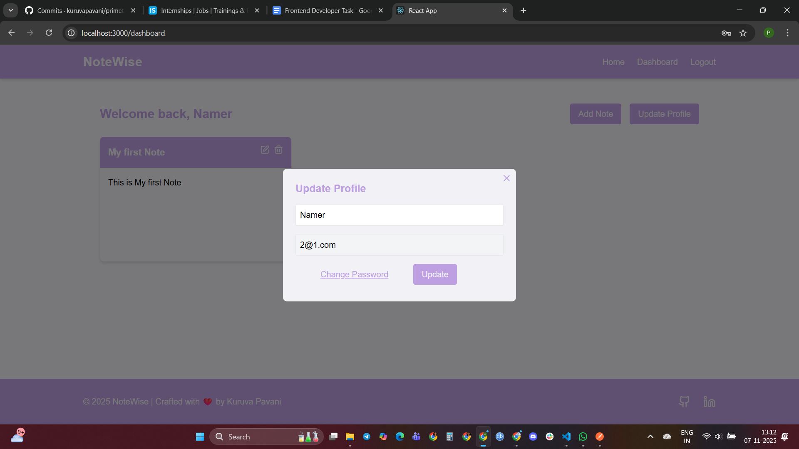
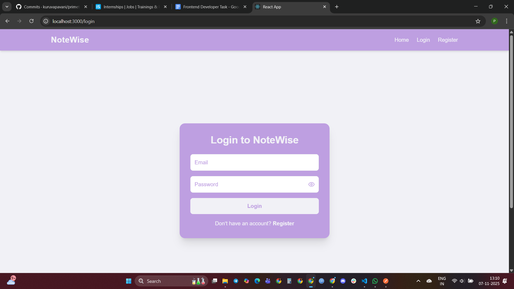
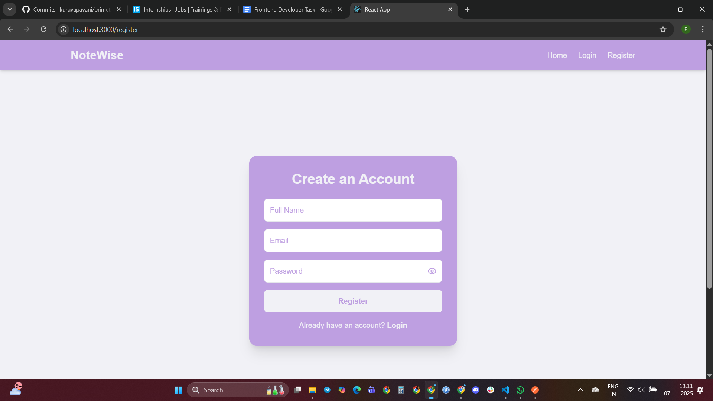
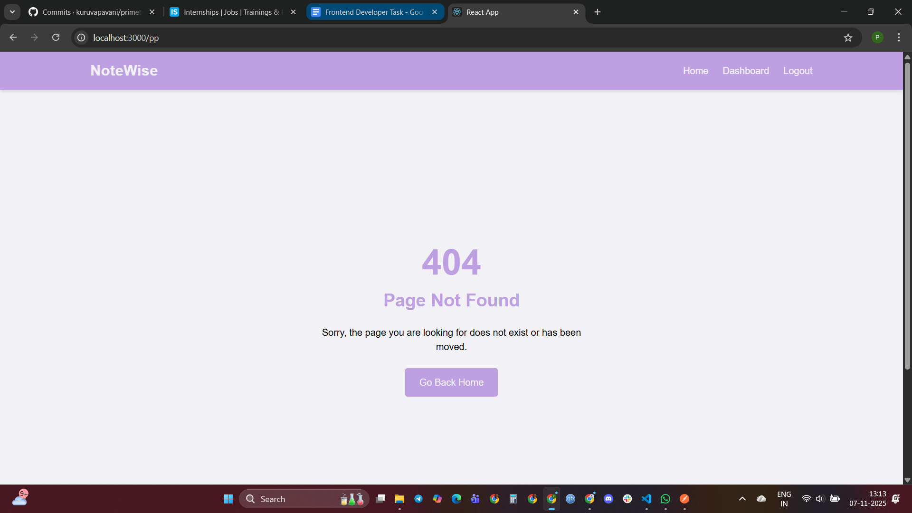

# NoteWise — Secure Notes Management App

## 📌 Overview
**NoteWise** is a full-stack web application that allows users to securely manage their notes. Built with **React** for the frontend and **Node.js + Express** for the backend, it features authentication, JWT-based security, password hashing, and full CRUD operations for notes. TailwindCSS is used for styling to provide a modern, responsive UI.

---
## 🌐 Deployed Version
Check out the deployed version here: [https://primetrade-orpin.vercel.app/]

---

## 🚀 Features

- **Secure Login & Register**
- **Password hashing** using `bcrypt`
- **Authentication** with `jsonwebtoken` (JWT)
- **CRUD Notes Operations** (Create, Read, Update, Delete)
- **Update Username** in profile
- **Update Password**
- **Password Validation**
  - Minimum 6 characters
  - At least 1 uppercase letter
  - At least 1 lowercase letter
  - At least 1 special character
- **Responsive Design** with TailwindCSS
- **Error Handling** (404 page, validation errors)
- **Toast Notifications** for better user experience

---

## 🖼 Screenshots

### Home Page


### Dashboard


### Add Note


### Edit Note


### Delete Note


### Update Profile


### Login Page


### Register Page


### Error Page (404)


---


## 💻 How to Run the Project

1. **Clone the repository**
```bash
git clone https://github.com/kuruvapavani/primetrade.git
````

2. **Setup Backend**

```bash
cd backend
npm install
npm run dev
```

3. **Setup Frontend**

```bash
cd frontend
npm install
npm start
```

4. **Open in Browser**

* Frontend will run on `http://localhost:3000`
* Backend will run on `http://localhost:5000` (or your `.env` PORT)

---

## ⚙ Environment Variables

### Backend (`.env`)

```
MONGODB_URI=your_mongodb_connection_string
JWT_SECRET=your_jwt_secret
PORT=5000
FRONTEND_URL=http://localhost:3000
```

### Frontend (`.env`)

```
REACT_APP_BASE_URL=http://localhost:5000
```

---

## 🛠 Tech Stack

* **Frontend:** React.js, TailwindCSS
* **Backend:** Node.js, Express.js
* **Database:** MongoDB
* **Authentication:** JWT
* **Password Security:** bcrypt
* **Notifications:** Sonner (toast notifications)

---


## ⚠️ Disclaimer

This project is created solely for assignment and learning purposes.


